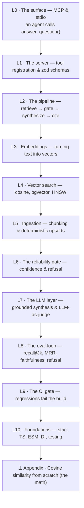

# LEARNING — reverse-engineer FinDocs MCP, top to bottom

This is a **learning layer** over the codebase. The idea is *reverse learning*: start
at the surface (an agent calls a tool) and **descend**, one layer at a time, until you
hit the fundamentals at the bottom (cosine geometry, ANN indexes, SQL, the MCP wire
protocol). Every concept is tied to the **exact file and function** that implements it
here, plus a "trace it yourself" and a "break it" experiment so you learn by poking a
*real, working* system instead of a toy.

> If you only read one thing first: run `pnpm calibrate`. It runs the whole retrieval +
> scoring pipeline **with no database and no API keys** and prints the numbers you'll
> spend this curriculum understanding.

---

## The descent

You're going to walk *down* this ladder. Each rung is a chapter in
[`docs/learning/`](docs/learning/). Read them in order for the full reverse-trace, or
jump to whatever rung you're curious about.

| Rung | Chapter | The question it answers | Lives in code at |
|------|---------|-------------------------|------------------|
| L0 | [01 · The MCP surface](docs/learning/01-mcp-and-the-surface.md) | How does an AI agent actually *call* this? What is MCP/stdio? | `src/mcp/server.ts` |
| L1 | [01 · (same chapter)](docs/learning/01-mcp-and-the-surface.md) | How are the 3 tools declared and validated? | `src/mcp/server.ts` |
| L2 | [02 · The answer pipeline](docs/learning/02-the-answer-pipeline.md) | What happens between question and answer? Wiring & DI. | `src/qa/answer.ts`, `src/services.ts` |
| L3 | [03 · Embeddings](docs/learning/03-embeddings.md) | How does text become a vector you can compare? | `src/embeddings/` |
| L4 | [04 · Vector search](docs/learning/04-vector-search-cosine-pgvector-hnsw.md) | How does "find similar" work? Cosine, pgvector, HNSW. | `db/schema.sql`, `src/db/repo.ts` |
| L5 | [05 · Chunking & ingestion](docs/learning/05-chunking-and-ingestion.md) | Why split docs? How are chunks made reproducible? | `src/ingest/` |
| L6 | [06 · The reliability gate](docs/learning/06-the-reliability-gate.md) | How does it refuse instead of hallucinating? | `src/qa/gate.ts` |
| L7 | [07 · Synthesis & citations](docs/learning/07-grounded-synthesis-and-citations.md) | How is the answer written & cited? What's the judge? | `src/llm/` |
| L8 | [08 · The eval-loop](docs/learning/08-the-eval-loop.md) | How do you *measure* a RAG system? | `evals/` |
| L9 | [09 · The CI regression gate](docs/learning/09-ci-regression-gate.md) | How does a metric drop turn the build red? | `.github/workflows/ci.yml` |
| L10 | [10 · TypeScript & architecture](docs/learning/10-typescript-and-architecture.md) | Why strict TS, ESM, adapters, factories? | `tsconfig.json`, factories |
| ⊥ | [Appendix · Cosine from scratch](docs/learning/90-appendix-cosine-from-scratch.md) | The actual linear algebra, by hand. | — |

---

## How to use this layer

1. **Keep the code open beside the chapter.** Every chapter names real functions. Open
   them. The header of each major source file starts with a `LEARN ▸` line pointing back
   to its chapter, so you can navigate from code → curriculum too.
2. **Run the experiments.** Each chapter has a *Trace it yourself* (observe) and a
   *Break it* (change something, watch a number move). The fastest feedback loops need
   no Docker:
   - `pnpm calibrate` — full retrieval + scoring, in-memory, no DB, no keys.
   - `pnpm test` — the unit suite (each test is a worked example of one concept).
   - `pnpm smoke` — start the MCP server and list its tools.
3. **Do the exercises.** They're small, and most are checkable by re-running a script.
4. **Follow "Go deeper" only when you want the next rung down.** That's the reverse-learn
   path: you never study a fundamental until you've seen the thing above it depend on it.

## What you'll be able to explain when you're done

- What MCP is, and why "tools over stdio with JSON Schemas" is the shape agents speak.
- What an embedding *is*, why normalized vectors make dot-product == cosine, and what
  the 384 numbers mean.
- How pgvector stores vectors and how an **HNSW** index finds nearest neighbours fast.
- Why RAG systems **chunk**, and how to make ingestion deterministic & idempotent.
- Why a **confidence gate + refusal** is the reliability core, and how to tune it.
- How to *evaluate* retrieval and generation: **recall@k, MRR, faithfulness
  (LLM-as-judge), refusal accuracy** — and how a **baseline gate** stops regressions.
- The strict-TypeScript and dependency-injection patterns that keep all of this testable.

## Suggested prerequisites (don't over-prepare)

You need: basic TypeScript/JS, comfort in a terminal, and rough SQL literacy. You do
**not** need prior ML, linear algebra, or vector-DB experience — those are the rungs at
the bottom, and we build them up from the project, not the other way around.

---

*Map back to the build: [README.md](README.md) explains the product and how to run it;
this file explains how to understand it.*
